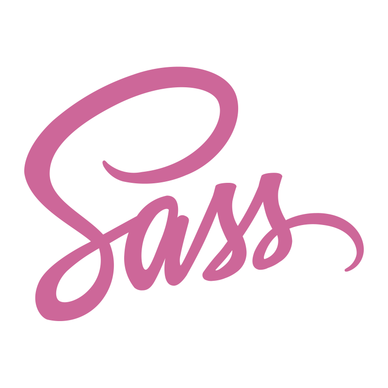

# Hey 👋, I'm Alireza Moradi

  I am a passionate 
  **JavaScript Full Stack Developer**
  with a strong focus on creating dynamic and 
  responsive web applications.

- ⭐ Every day is an opportunity to get better

- 👨‍💻 I'm currently working on [this Project]()

- 🪴 I'm currently learning **TypeScript & ReactJs**

- 💬 Ask me about **Web Development with JavaScript**

- 💫 Fun Fact **I ❤️ 💪 & 🎸**

  ### ⚒️ Languages & Tools ⚒️

  
  
  
  
  
  
  
  
  
  
  

  ### 🎗️ Github Stats 🎗️

  

  

  ### 🤝 Connect With Me 🤝
  
  

